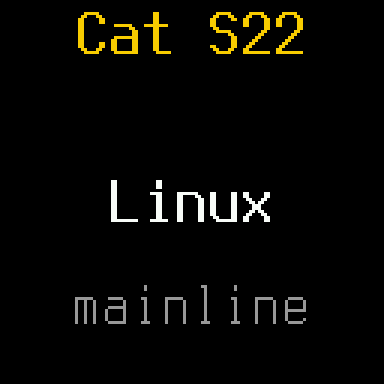

<div align="center">



# Mainline Linux on the Cat S22 Flip

**A rugged Android Go flip phone, running a current mainline kernel.**


-2ea44f)


**[Getting started →](GETTING-STARTED.md)** &nbsp;·&nbsp;
**[Hardware notes →](HARDWARE.md)**

</div>

The Cat S22 Flip is a small, capable Linux machine in a phone body: four
Cortex-A53 cores, 2 GB of RAM, LTE, WiFi, two screens, a keypad, sensors and
a battery that idles for days. This repository has everything learned about
it, plus the tools and bring-up scripts to run mainline Linux on it.

## What works

| | Hardware | Status |
|---|---|---|
| ✅ | **CPU, RAM** | 4× A53 at stock's 1.21 GHz (this chip's speed bin), 2 GB |
| ✅ | **Main display** | 480×640 ST7701S on MSM DRM/DSI with a real panel driver, backlight control |
| ✅ | **Outer display** | 128×128 SPI panel (`panel-mipi-dbi`) |
| ✅ | **Keypad** | Full matrix, D-pad, soft keys, volume, power, lid switch |
| ✅ | **WiFi** | WCN3610, 2.4 GHz 802.11n: WPA2, DHCP, HTTPS |
| ✅ | **Audio** | Earpiece, both microphones, loudspeaker (AW88194A amp with its DSP) |
| ✅ | **Sensors** | Accelerometer, proximity, light, pressure (through the ADSP, `s22-sensord`) |
| ✅ | **Modem** | Boots, QMI, goes online and measures LTE cells (no SIM tested yet) |
| ✅ | **USB-C** | Charging, battery level, USB networking (WUSB3801 Type-C) |
| ✅ | **Suspend** | s2idle; wakes on power key, lid, keypad, RTC |
| 🟡 | **Bluetooth** | Registers (`hci0`); pairing not tested yet |
| 🟡 | **Calls, SMS, mobile data** | Modem-side IMS and a T-Mobile profile are present; needs a SIM to test |
| 🟡 | **Headset jack, vibration motor** | Detected; not tested |
| 🟡 | **USB host (OTG)** | Probably data-capable, but the phone cannot power the port |
| ❌ | **Cameras, flash LED, video decoding (Venus), touchscreen, FM radio** | Not started |

## How it boots

```
stock bootloaders (sbl1, tz, rpm, aboot)   signed by the vendor, never touched
        │
lk2nd   (boot partition)                   our build; boots kernels, offers fastboot
        │
Linux   (mainline msm89x7 + this phone's drivers)
        ├── from RAM:  initramfs/ bring-up image (fastboot boot)
        └── installed: /boot on ext2 "cache", / on "userdata"
```

The phone's chain of trust is enforced in hardware, so the stock bootloaders
stay as they are. After the bootloader is unlocked they start
[lk2nd](https://github.com/bropple/lk2nd/tree/s22flip) from the `boot`
partition, which boots everything else. [GETTING-STARTED.md](GETTING-STARTED.md)
walks through it step by step.

## The phone

| | |
|---|---|
| SoC | Qualcomm QM215: 4× Cortex-A53 @ 1.3 GHz (1.21 GHz on this bin), Adreno 308 |
| PMIC | PM8916 |
| Memory | 2 GB RAM, 16 GB eMMC, microSD |
| Displays | 2.8" 480×640 ST7701S (DSI) inside, 128×128 SPI outside |
| Radios | LTE Cat 4 modem, WCN3610 WiFi 2.4 GHz + Bluetooth |
| Battery | 2000 mAh |

## Related repositories

| What | Where |
|---|---|
| Kernel: `msm89x7/7.1.3` + WCN3610 patches + this phone's drivers, config fragment and `qm215-cat-s22flip.dts` | [bropple/linux `s22flip`](https://github.com/bropple/linux/tree/s22flip) |
| lk2nd with a QM215 entry that boots on this phone | [bropple/lk2nd `s22flip`](https://github.com/bropple/lk2nd/tree/s22flip) |
| The minimal DTBO the stock bootloader needs before it will start lk2nd | [bropple/dtbo-lk2nd `s22flip`](https://github.com/bropple/dtbo-lk2nd/tree/s22flip) |

## Tools in this repository

| File | Purpose |
|---|---|
| `collect.sh` | Collect hardware info over (unrooted) ADB |
| `tools/backup_partitions.sh` | Stream every partition except `userdata` off a rooted phone, with SHA-1 checks against the device |
| `tools/imgpatch.py` | Apply Android OTA `IMGDIFF2` patches off-device (rebuilds v30 images from the v29 full OTA + v30 incremental) |
| `tools/mkmipidbi.py` | Convert the stock outer-display init sequence into a `panel-mipi-dbi` firmware file |
| `initramfs/` | Busybox bring-up image that runs only in RAM, its build script, and the outer-display splash |
| `tools/s22sh` | Run a command on the bring-up image over telnet |
| `tools/mkrootfs.sh` | Build the Alpine aarch64 toolbox the bring-up image fetches into RAM over USB |
| `tools/phone/` | Phone-side scripts: EFS into RAM, `rmtfs`, start the modem |
| `tools/s22-sensord.c` | The sensor daemon: registry and time services for the ADSP, sensor streams as input devices and files |
| `tools/sns-reg-serve.c`, `tools/qmisend.c`, `tools/sns-reg-groups.py` | Sensor-registry server, raw QMI tool, group-table extractor |
| `tools/mkstockref.sh` | Build a stock-kernel reference image (for comparing against stock behaviour) |

> [!IMPORTANT]
> **No firmware is included, and none should be shared.** The modem, WiFi,
> DSP and video firmware are signed blobs from your own phone, and the
> `persist` and EFS partitions hold your IMEI and radio calibration.
> [GETTING-STARTED.md](GETTING-STARTED.md) shows where each file comes from.
