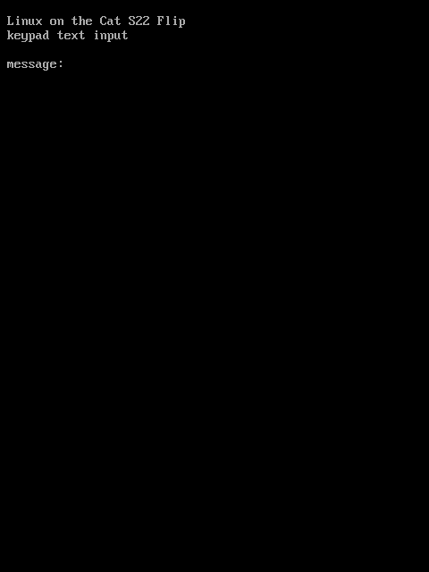

<div align="center">


# Mainline Linux on the Cat S22 Flip

**A rugged Android Go flip phone, running a current mainline kernel.**


-2ea44f)


**[Getting started →](GETTING-STARTED.md)** &nbsp;·&nbsp;
**[Hardware notes →](HARDWARE.md)**

</div>

The Cat S22 Flip is a small, capable Linux machine in a phone body: four
Cortex-A53 cores, 2 GB of RAM, LTE, WiFi, two screens, a keypad, sensors and
a battery that idles for days. This repository has everything learned about
it, plus the tools and bring-up scripts to run mainline Linux on it.

It works as a daily phone: calls, texts, mobile data, WiFi, Bluetooth, both
screens, the cameras and the sensors all run on mainline. Development is
paused as of October 2026; everything below is the state it was left in.

## What works

| | Hardware | Status |
|---|---|---|
| ✅ | **CPU, RAM** | 4× A53 at stock's 1.21 GHz (this chip's speed bin), 2 GB |
| ✅ | **Main display, GPU** | 480×640 ST7701S on MSM DRM/DSI with a real panel driver, backlight control; Adreno 308 (freedreno, OpenGL ES 3.0) at its fused 400 MHz |
| ✅ | **Touchscreen** | Chipsemi CHSC, multi-touch |
| ✅ | **Outer display** | 128×128 SPI panel (`panel-mipi-dbi`) |
| ✅ | **Keypad** | Full matrix, D-pad, soft keys, side key, speaker key, volume, power, lid switch |
| ✅ | **WiFi, Bluetooth** | WCN3610, 2.4 GHz 802.11n; Bluetooth LE and classic, A2DP audio smooth during WiFi traffic after coexistence tuning |
| ✅ | **Audio** | Earpiece, both microphones, loudspeaker (AW88194A amp with its DSP) |
| ✅ | **Calls, SMS, mobile data** | VoLTE calls (call audio on the ADSP, earpiece or speakerphone), sending and receiving texts, IPv6 mobile data; tested with a T-Mobile-network SIM |
| ✅ | **Sensors** | Accelerometer, proximity, light, pressure (through the ADSP, `s22-sensord`) |
| ✅ | **Cameras, flash** | Rear GC5035 with DW9714 autofocus and front GC02M2, raw through CAMSS; flash LED as a torch. Colour balance still needs tuning |
| ✅ | **Video** | Venus: H.264, HEVC and VP8 decoding, H.264 encoding (V4L2) |
| ✅ | **Vibration motor** | PM8916 vibrator, patterns through force feedback |
| ✅ | **USB-C** | Charging, battery level, USB networking (WUSB3801 Type-C) |
| ✅ | **Power** | s2idle suspend (wakes on power key, lid, keypad, RTC); the SoC reaches VDD minimisation when idle, and the modem sleeps ~98% of the time |
| 🟡 | **Wired headset** | No 3.5 mm jack: analog audio over USB-C through an FSA4480 switch, passive adapters only; not supported yet |
| 🟡 | **USB host (OTG)** | Probably data-capable, but the phone cannot power the port |
| ❌ | **GPS, FM radio** | Not started |

## Typing with 12 keys

Real captures of the phone's screen. `s22-t9d` turns the keypad into a
multi-tap keyboard for the console, with a small indicator in the corner for
the mode, the candidates, and (at password prompts) a count of characters
typed. [Keypad reference](docs/KEYPAD.md).

<table align="center">
<tr>
<td align="center"></td>
<td align="center"></td>
</tr>
<tr>
<td align="center"><sub>A message, then a password: only a count of characters is shown</sub></td>
<td align="center"><sub><code>ls</code>, nano, <code>cat</code>, <code>xxd</code> (at a quicker tap rate than the default)</sub></td>
</tr>
</table>

Both are the whole 480×640 screen, the 60×40 console as you see it on the phone.

## How it boots

```
stock bootloaders (sbl1, tz, rpm, aboot)   signed by the vendor, never touched
        │
lk2nd   (boot partition)                   our build; boots kernels, offers fastboot
        │
Linux   (mainline msm89x7 + this phone's drivers)
        ├── from RAM:  initramfs/ bring-up image (fastboot boot)
        └── installed: /boot on ext2 "cache", / on "userdata"
```

The phone's chain of trust is enforced in hardware, so the stock bootloaders
stay as they are. After the bootloader is unlocked they start
[lk2nd](https://github.com/bropple/lk2nd/tree/s22flip) from the `boot`
partition, which boots everything else. [GETTING-STARTED.md](GETTING-STARTED.md)
walks through it step by step.

## The phone

| | |
|---|---|
| SoC | Qualcomm QM215: 4× Cortex-A53 @ 1.3 GHz (1.21 GHz on this bin), Adreno 308 |
| PMIC | PM8916 |
| Memory | 2 GB RAM, 16 GB eMMC, microSD |
| Displays | 2.8" 480×640 ST7701S (DSI) inside, 128×128 SPI outside |
| Radios | LTE Cat 4 modem, WCN3610 WiFi 2.4 GHz + Bluetooth |
| Battery | 2000 mAh |

## Related repositories

| What | Where |
|---|---|
| Kernel: `msm89x7/7.1.3` + WCN3610 patches + this phone's drivers, config fragment and `qm215-cat-s22flip.dts` | [bropple/linux `s22flip`](https://github.com/bropple/linux/tree/s22flip) |
| lk2nd with a QM215 entry that boots on this phone | [bropple/lk2nd `s22flip`](https://github.com/bropple/lk2nd/tree/s22flip) |
| The minimal DTBO the stock bootloader needs before it will start lk2nd | [bropple/dtbo-lk2nd `s22flip`](https://github.com/bropple/dtbo-lk2nd/tree/s22flip) |

## Tools in this repository

| File | Purpose |
|---|---|
| `collect.sh` | Collect hardware info over (unrooted) ADB |
| `tools/backup_partitions.sh` | Stream every partition except `userdata` off a rooted phone, with SHA-1 checks against the device |
| `tools/imgpatch.py` | Apply Android OTA `IMGDIFF2` patches off-device (rebuilds v30 images from the v29 full OTA + v30 incremental) |
| `tools/mkmipidbi.py` | Convert the stock outer-display init sequence into a `panel-mipi-dbi` firmware file |
| `initramfs/` | Busybox bring-up image that runs only in RAM, its build script, and the outer-display splash |
| `tools/s22sh` | Run a command on the bring-up image over telnet |
| `tools/mkrootfs.sh` | Build the Alpine aarch64 toolbox the bring-up image fetches into RAM over USB |
| `tools/phone/` | Phone-side scripts: EFS into RAM, `rmtfs`, start the modem |
| `tools/s22-sensord.c` | The sensor daemon: registry and time services for the ADSP; sensors run on demand while a client holds them, as input devices and files |
| `tools/s22-sensor` | Hold sensors from `s22-sensord` and print their readings |
| `tools/sns-reg-serve.c`, `tools/qmisend.c`, `tools/sns-reg-groups.py` | Sensor-registry server, raw QMI tool, group-table extractor |
| `tools/mkstockref.sh` | Build a stock-kernel reference image (for comparing against stock behaviour; options for prima WiFi traces, crash-dump mode, modem firmware) |
| `tools/s22-t9d.c` | Keypad text input: multi-tap letters, modes, Ctrl, a console indicator, the keypad backlight ([reference](docs/KEYPAD.md)) |
| `tools/s22-lidd.c` | Main display off while the lid is closed; runs hooks on lid changes and after resume |
| `tools/s22-lidd.d/` | Lid hooks: WiFi power save off with the lid open, on with it closed |
| `tools/s22-outerd/` | Outer display status screen (clock, date, WiFi, Bluetooth, battery, notification ticker, wallpaper); owns the lid-closed keys: side = browse/dismiss notifications, volume = media through a hook |
| `tools/s22-notify/` | Notifications: `s22-notify` posts them (with a source and a link), `s22-notifyd` plays a sound and a vibration pattern, chosen per app and per contact |
| `tools/s22-smsd/` | Incoming text messages over QMI WMS (libqmi from Python): decoded, kept in an inbox file, posted as `sms` notifications, deleted from the modem; never starts mobile data |
| `tools/s22-imsd/` | The AP side of the modem's IMS data connection (QMI service 770): brings up the IMS PDN when the modem's own IMS stack asks, without which the modem never sleeps |
| `tools/s22-battery/` | Battery log every 5 minutes (charge, voltage, lid, modem and system sleep counters) and a one-shot clean power-off at 5%; keeps a smoothed capacity on top of the PM8916 voltage-mode gauge, which jumps with load |
| `tools/s22-call/` | VoLTE calls without a GUI: rings (ringtone and vibration), answers when the flip opens (or Call), hangs up when it closes (or End); holds the modem's hostless voice PCM (`s22-pcmhold`) and routes earpiece, speakerphone and keypad mic; ringback, mute, DTMF, voicemail, a call log; `s22-call dial NUMBER\|answer\|hangup\|speaker\|status` |
| `tools/s22-celld/` | Cellular status for the screens (service, signal bars, operator), a registration watchdog, mobile data that stays off while WiFi works, and radio on/off |
| `tools/openrc/s22-console.map` | Console keymap additions (`/etc/s22-console.map`, see `conf.d/keymaps`): volume and power keys stop typing escape codes into the tty |
| `tools/s22-partguard` | Make the eMMC partitions a system does not need read-only, with eMMC power-on write protection |
| `tools/openrc/` | OpenRC services for an installed system: partition guard, zram, clock, USB network, rmtfs, tqftpserv, sensors, keypad, lid, outer display, notifications, battery, texts, IMS, calls, cellular, tailscaled ([list](tools/openrc/README.md)) |

> [!IMPORTANT]
> **No firmware is included, and none should be shared.** The modem, WiFi,
> DSP and video firmware are signed blobs from your own phone, and the
> `persist` and EFS partitions hold your IMEI and radio calibration.
> [GETTING-STARTED.md](GETTING-STARTED.md) shows where each file comes from.
